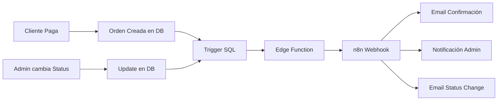

# 🚀 Quick Setup - Admin Dashboard & n8n Integration

## ✅ Lo que se ha implementado

### 1. **Order Management en Admin Dashboard**
📍 Ruta: `/admin` → Tab "Orders"

**Características:**
- ✅ Ver todas las órdenes con detalles completos
- ✅ Filtrar por estado (pending, processing, shipped, delivered, cancelled)
- ✅ Búsqueda por número de orden, nombre o email
- ✅ Cambiar estado de órdenes directamente
- ✅ Ver detalles completos (cliente, dirección, pago, items)
- ✅ Exportar a CSV
- ✅ Modal detallado por orden

### 2. **Webhooks para n8n**
📍 Edge Function: `supabase/functions/n8n-webhook/index.ts`

**Eventos que disparan webhooks:**
- 🆕 `order.created` - Nueva orden creada
- 🔄 `order.status_changed` - Cambio de estado
- 💳 `order.payment_updated` - Actualización de pago

### 3. **Database Triggers**
📍 Migration: `supabase/migrations/20250104_n8n_webhooks.sql`

**Triggers configurados:**
- `orders_insert_webhook` - Se dispara al INSERT
- `orders_update_webhook` - Se dispara al UPDATE (solo si cambió status o payment_status)

---

## 🔧 Setup Rápido (5 minutos)

### Paso 1: Deploy Edge Function
```bash
supabase functions deploy n8n-webhook
```

### Paso 2: Aplicar Migration
```bash
supabase db push
```

### Paso 3: Configurar Variables de Entorno en Supabase

Ve a **Supabase Dashboard > Project Settings > Edge Functions**:

```bash
# URLs de tus workflows de n8n
N8N_WEBHOOK_ORDER_CREATED=https://your-n8n.com/webhook/order-created
N8N_WEBHOOK_ORDER_STATUS_CHANGED=https://your-n8n.com/webhook/order-status-changed
N8N_WEBHOOK_ORDER_PAYMENT_UPDATED=https://your-n8n.com/webhook/order-payment-updated

# Secret para validación (opcional pero recomendado)
N8N_WEBHOOK_SECRET=tu_secret_aqui
```

### Paso 4: Crear Workflows en n8n

Sigue la guía completa en: **[N8N_INTEGRATION_GUIDE.md](./N8N_INTEGRATION_GUIDE.md)**

Templates de workflows incluidos:
1. ✉️ Email de confirmación de orden
2. 📦 Notificación de envío
3. ✅ Notificación de entrega
4. 💳 Confirmación de pago

---

## 📊 Admin Dashboard - Nuevas Funcionalidades

### Orders Tab
```
┌─────────────────────────────────────────────────────────────┐
│  Order Management                        [Export CSV]        │
├─────────────────────────────────────────────────────────────┤
│  [Search: order#/name/email]  [Filter by Status]            │
├─────────────────────────────────────────────────────────────┤
│  Order         Customer        Status      Payment   Total   │
│  #ORDER-123    John Doe       [Processing] [Approved] $50    │
│  #ORDER-124    Jane Smith     [Shipped]    [Approved] $100   │
└─────────────────────────────────────────────────────────────┘
```

**Click en el ícono 👁️ para ver detalles completos:**
- Información del cliente
- Dirección de envío
- Detalles de pago
- Lista de productos
- Timeline del pedido

---

## 🔄 Flujo de Automatización



---

## 🧪 Testing

### Test 1: Crear Orden de Prueba
```bash
# Haz un pago de prueba con PayPal/MercadoPago
# Verifica que:
# 1. La orden aparece en /admin → Orders
# 2. El webhook se disparó (ver logs en Supabase)
# 3. El email se envió (verificar en n8n executions)
```

### Test 2: Cambiar Estado
```bash
# En /admin → Orders:
# 1. Click en select de status
# 2. Cambiar a "Shipped"
# 3. Verificar webhook en n8n
# 4. Verificar email de envío
```

### Test 3: Ver Logs
```bash
# Logs de Edge Function
supabase functions logs n8n-webhook --tail

# Ver últimas 10 ejecuciones
supabase functions logs n8n-webhook -n 10
```

---

## 📧 Templates de Email

### Email de Confirmación
```
Asunto: ✅ Orden Confirmada - #ORDER-123

¡Hola [Nombre]!

Tu orden #ORDER-123 ha sido confirmada.

Productos:
- Collar Miyuki x1 - $10.00

Total: $10.00

Recibirás un email cuando sea enviado.
```

### Email de Envío
```
Asunto: 📦 Tu pedido ha sido enviado

¡Hola [Nombre]!

Tu orden #ORDER-123 está en camino.
Tiempo estimado: 3-5 días hábiles.
```

---

## 🎯 Próximas Mejoras Sugeridas

- [ ] Tracking de envío con número de guía
- [ ] Notificaciones push en el admin
- [ ] Integración con WhatsApp Business
- [ ] Dashboard de métricas en tiempo real
- [ ] Auto-actualización de inventario
- [ ] Sistema de reviews post-entrega
- [ ] Facturación electrónica automática

---

## 📚 Documentación Completa

- **[N8N_INTEGRATION_GUIDE.md](./N8N_INTEGRATION_GUIDE.md)** - Guía detallada de integración con n8n
- **[README.md](./README.md)** - Documentación general del proyecto

---

## 🆘 Troubleshooting

### Webhook no se dispara
```bash
# Verificar triggers
SELECT * FROM information_schema.triggers 
WHERE event_object_table = 'orders';

# Ver logs
supabase functions logs n8n-webhook --tail
```

### Email no llega
1. Verificar credenciales en n8n (Gmail/SMTP)
2. Revisar executions en n8n
3. Verificar carpeta de spam

### Error 500 en Edge Function
```bash
# Ver logs detallados
supabase functions logs n8n-webhook -n 50
```

---

## ✅ Checklist de Verificación

- [ ] Edge function deployed
- [ ] Migration aplicada
- [ ] Variables de entorno configuradas
- [ ] Workflows de n8n creados y activos
- [ ] Test de orden realizado
- [ ] Email de confirmación recibido
- [ ] Admin dashboard accesible
- [ ] Status change funciona

---

¡Listo! Tu sistema de automatización está configurado. 🎉